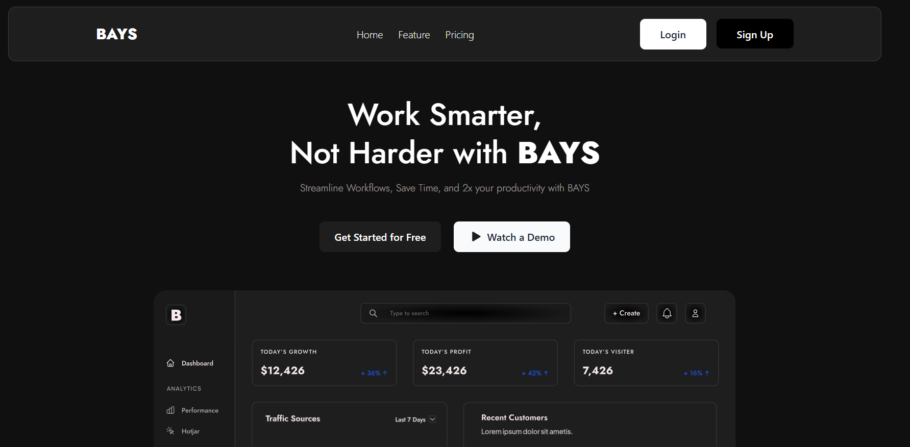

# Bays - Figma to Production Website

**Bays** is a fully responsive and production-ready landing page, built by converting a Figma design into clean, maintainable code.  
This project focuses on real-world design-to-development workflow, enhancing frontend development skills.

You can check out the live version here: [feedspace-bays.vercel.app](https://feedspace-bays.vercel.app)

---

## 🚀 **Features**

- **Pixel-perfect Figma to Code Conversion**: Carefully recreated based on a real Figma design.
- **Dynamic Content Integration**: Smoothly integrated dynamic elements for a realistic web experience.
- **Real-world Development Workflow**: Following production-level coding standards.
- **Fully Responsive** – Looks great on all devices (desktop, tablet, and mobile).

---

## ⚙️ **Tech Stack**

- **Frontend**:
  - **Next.js** – React framework with SSR and SSG capabilities for better performance.
  - **React** – Building interactive and reusable UI components.
  - **Tailwind CSS** – Utility-first CSS framework for rapid, responsive design.

---

## 📈 **Future Enhancements**

- Adding animations for a more dynamic user experience.
- Implementing CMS integration for dynamic content management.

---

## 📷 **Screenshots**

